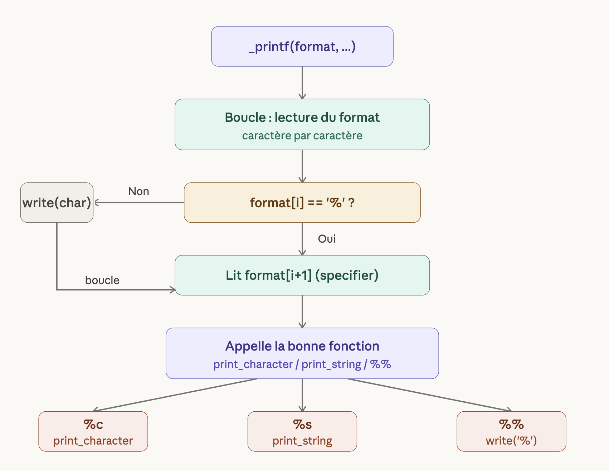

# _printf

## 🔄 Flowchart

The following flowchart explains the logic of `_printf` :



The function reads the format string character by character.
When it encounters `%` it reads the next character to identify
the specifier and calls the corresponding handler function.
Otherwise it writes the character directly to stdout.


## 📌 Description

`_printf` is a custom reimplementation of the standard C `printf` function,
developed as part of the Holberton School curriculum.

It produces formatted output to stdout by parsing a format string
and handling specific conversion specifiers using variadic functions.

This project aims to understand:
* String parsing character by character
* Variadic functions (`va_list`, `va_start`, `va_arg`, `va_end`)
* Low-level output with `write` instead of `printf`
* Function pointers and struct-based dispatch

---

## ⚙️ Prototype
```c
int _printf(const char *format, ...);
```

---

## 🛠️ Requirements

* Ubuntu 20.04 LTS
* gcc compiler
* Betty coding style compliant

---

## 📥 Compilation
```bash
gcc -Wall -Werror -Wextra -pedantic -std=gnu89 -Wno-format *.c
```

---

## 🧩 Supported specifiers

| Specifier | Description |
|-----------|-------------|
| `%c` | Prints a single character |
| `%s` | Prints a string of characters |
| `%%` | Prints a literal `%` sign |

---

## 📂 File structure

| File | Description |
|------|-------------|
| `main.h` | Header file — prototypes and includes |
| `_printf.c` | Main function — parses the format string |
| `print_character.c` | Handles `%c` and `%%` |
| `print_string.c` | Handles `%s` |
| `man_3_printf` | Manual page for `_printf` |
| `README.md` | Project documentation |

---

## 🚀 Usage example
```c
#include "main.h"

int main(void)
{
    _printf("Hello %s!\n", "Holberton");
    _printf("Character: %c\n", 'A');
    _printf("Percent sign: %%\n");
    return (0);
}
```

---

## 🧩 Fonctionnalités implémentées

| Spécificateur | Description                      |
| ------------- | -------------------------------- |
| `%c`          | Affiche un caractère             |
| `%s`          | Affiche une chaîne de caractères |
| `%%`          | Affiche le caractère `%`         |
| `%d`          | Affiche un entier décimal        |
| `%i`          | Affiche un entier décimal        |
---

## 🛠️ Fonctions principales

* `_printf` : fonction principale qui parcourt la chaîne de format et gère les spécificateurs
* `handle_format` : sélectionne la fonction appropriée selon le spécificateur
* `print_char` : affiche un caractère
* `print_string` : affiche une chaîne de caractères
* `print_int` : affiche un entier (`%d` ou `%i`)

---

## 📂 Structure du projet

```
_printf/
├── main.h            # Header file avec les prototypes et include guards
├── _printf.c          # Fonction principale _printf
├── handle_format.c    # Dispatch selon le spécificateur
├── print_char.c       # Affichage d'un caractère
├── print_string.c     # Affichage d'une chaîne de caractères
├── print_int.c        # Affichage d'un entier (%d et %i)
├── README.md              # Documentation du projet
├── _printf.3              # Man page
└── main.c                 # Fichier de test (facultatif, non rendu)
```

---

## ⚠️ Limitations

* Ne gère pas :

  * les flags
  * la largeur (width)
  * la précision
  * les modificateurs de longueur


---

## 🧪 Tests

## 🧪 Exemple de test (main.c)

Le fichier `main.c` peut être utilisé pour tester le comportement de la fonction `_printf` en la comparant à la fonction standard `printf`.

Il couvre plusieurs cas de test correspondant aux spécificateurs implémentés :

* affichage de caractères (`%c`)
* affichage de chaînes (`%s`)
* affichage d'entiers (`%d` et `%i`)
* affichage du caractère `%` (`%%`)
* comparaison des longueurs retournées par `_printf` et `printf`


Exemple de tests :

```c
_printf("Char: %c\n", 'A');
_printf("String: %s\n", "Hello");
_printf("Percent: %%\n");
_printf("Int: %d\n", 42);
_printf("Int: %i\n", -42);
_printf("%s %c %% %d %i\n", "Test", 'X', 123, -456);
```

Ce programme permet de vérifier que `_printf` produit la même sortie et retourne la même valeur que `printf`.

---

## 👥 Auteurs

* Nom OurdaHolerton
* Nom rawan-holberton

---

## 📜 Licence

Ce projet est réalisé dans le cadre du programme Holberton School.

